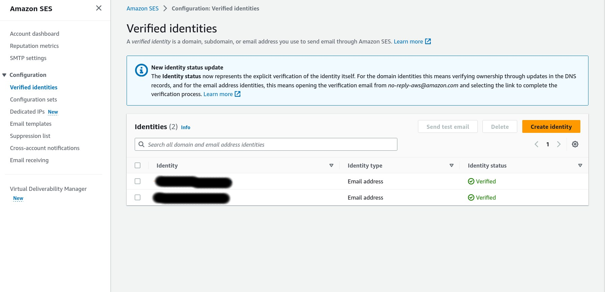

# Serverless-App
Simple serverless application using S3, API Gateway, Lambda, Step Functions, SNS &amp; SES.

My application is going to send reminder messages from email.App using AMAZON SES for this.In production, it could be configured to allow sending from the application email to any users of the application.But I dont want any spam mails and I only used verified address and because sure it's a demo app.
First chard of app:

 
Then I configure SES in aws

Then I create a email lambda function for using SES to send emails for the app.I start with creating lambda execution role for lambda.This roles gives permission to lambda for ses,sns and states.Then I create email reminder lambda function.
Chard for this part:

In This part I add state machine,which is the main component of this serverless application.State machine will control the flow of the app.It will initially pause for a number of seconds, the time until the next cuddle requirement.After the time's expired,the state machine then uses the email Lambda function to send a cuddle notification  customer maill adress.The state machine has role for interact to other services which I use in this project.I use step functions in aws for creating state machine.

In this part I create a lambda function for supporting API Gateway and API Gateway itself which will function as the entry point to  application. By creating the API Gateway, I have an endpoint that client application can use to talk to application itself.So I create lambda function and configure API Gateway. 

